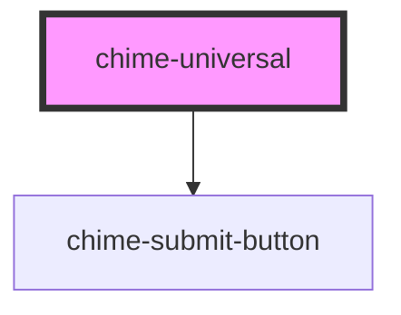

# chime-universal

<!-- Auto Generated Below -->

## Properties

| Property       | Attribute       | Description | Type     | Default     |
| -------------- | --------------- | ----------- | -------- | ----------- |
| `companyImage` | `company-image` |             | `string` | `null`      |
| `question`     | `question`      |             | `string` | `undefined` |
| `questioner`   | `questioner`    |             | `string` | `null`      |

## Events

| Event             | Description | Type                  |
| ----------------- | ----------- | --------------------- |
| `dismissQuestion` |             | `CustomEvent<String>` |
| `submitQuestion`  |             | `CustomEvent<any>`    |

## Dependencies

### Depends on

- [chime-submit-button](../chime-submit-button)

### Graph

----------------------------------------------

*Built with [StencilJS](https://stenciljs.com/)*
